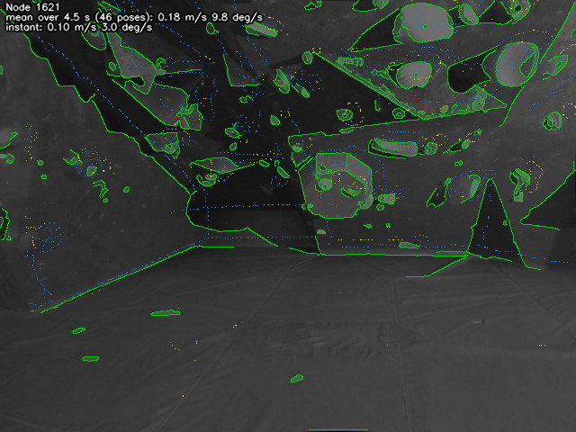
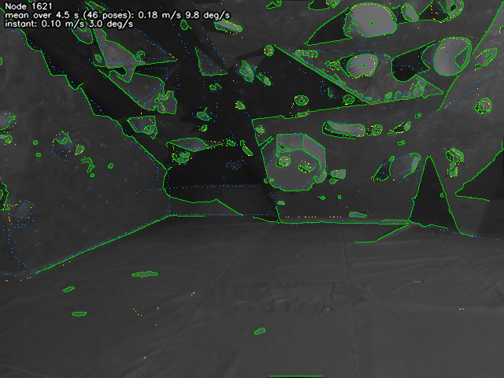
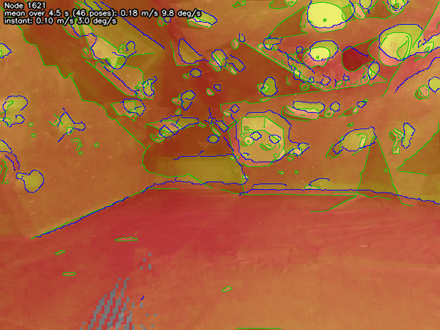
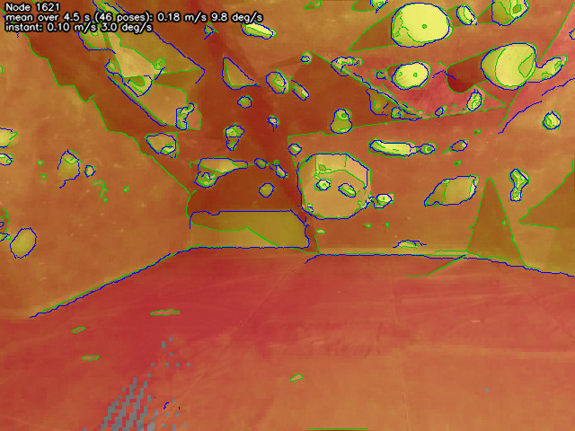
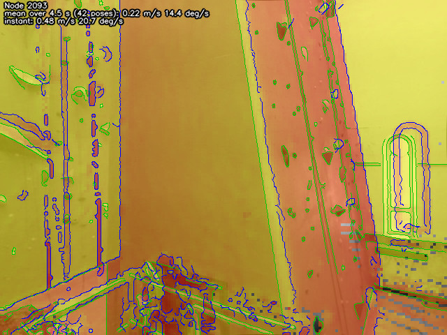
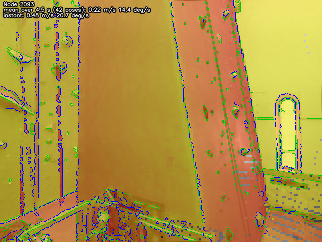

# rtabmap-lidarCameraCalibration

Refines the rotation between a camera and a lidar from a mapping session, without a calibration target. It aligns the edges the lidar sees (depth discontinuities, creases and reflectance changes) with the edges in the camera images, over all the nodes of an RTAB-Map database at once.

```bash
rtabmap-lidarCameraCalibration [options] map.db
```

The database is opened read-only. The tool prints a correction to apply to the camera's transform; it does not modify anything.

## What the database needs

Each node must have an image from one camera and a lidar scan taken at about the same time, with the camera's and the lidar's local transforms (from TF when mapping with ROS).

What helps:

- **Dense scans.** Edges are found where the scan, projected in the image, leaves no holes. An assembled cloud (a few lidar sweeps per node) at full resolution, or with a small voxel (2 cm), works better than a sparse one.
- **Images and scans taken together.** The tool assumes that the camera's and the lidar's clocks are synchronized: it does not estimate a time offset between them, which would look like a rotation while the robot turns. With `odom_sensor_sync`, the camera's transform stored in each node already compensates the motion between the image's and the scan's stamps. The tool estimates its correction on top of that.
- **Many nodes from varied viewpoints.** The correction is the one that fits all the nodes; a single view constrains it much less.
- **Intensity in the scans** (format `XYZI`). It is used when there; see below.

## How it works

For every node:

1. **Image edges.** Canny edges of the image, turned into a score with a distance transform: 1 on an edge, decreasing with the distance to it (`exp(-d / sigma)`, `--sigma`, default 3 pixels). The score is smooth enough for a search to follow it toward the edges.
2. **Lidar edges.** The scan is projected in the camera at a coarse resolution (`--decimation`, default 1/4 of the image), where the projected points are dense, keeping the nearest point per cell so that surfaces hidden from the camera do not count. A cell's point is a lidar edge point when:
   - it is in front of a depth discontinuity: a neighboring cell is at least 15% farther (`--jump`) than where this cell's surface would continue, as at the border of an object in front of a farther background. The continuation is predicted from the opposite neighbor (on a plane, inverse depth is linear in the image), so that a surface seen at a grazing angle, such as the floor ahead of a low camera, is not taken for a discontinuity: its depth changes fast from one cell to the next, but as its continuation predicts; or
   - it is on an intensity edge: the lidar's intensity changes by more than 40% to a neighboring cell (`--intensity_jump`), as at a change of paint or material. A cell's intensity is the mean (of the logarithm) over all the points of the surface it sees, not its nearest point's: a lidar's beams do not return the same intensity from the same surface, and a node's scan assembles several sweeps, so cells seen by different beams would otherwise differ and make false edges along the beams' traces, even on a flat uniform wall. Then it is median filtered against what speckle remains. As for creases (below), the cells only say where there is an intensity edge: where exactly is found at the image's full resolution. This is what finds edges on flat surfaces, where the depth does not jump: holds on a climbing wall, window frames, panels. `--no_intensity` turns it off; or
   - it is on a crease: the surface normals of neighboring cells differ by more than 45 degrees (`--crease_angle`, 0 disables), as between a wall and the floor, where the depth does not jump. Normals are computed on the scan voxelized (`--crease_voxel`, 10 cm), smoother than at full resolution; each voxel's normal is spread over the cells it covers, and averaged per cell like intensity. As the normals then change over a band of a few cells across a crease (and intensity across an intensity edge), where exactly it is is found at the image's full resolution, as Canny finds edges: the normals (or intensity) are interpolated and smoothed, and the edge is where their change is the largest across it, to a fraction of a pixel. Its depth is interpolated there (these edges are on continuous surfaces), and the point is put back in 3D, one per cell. Taking the nearest lidar point of each cell instead would put them anywhere in a band a few cells wide on both sides of the edge. They help most where surfaces all reflect alike, with few intensity edges.

   Each point is weighted by the size of its jump. The edge points are kept in 3D, in the scan's frame, so that they can then be projected at full resolution.

Then a solver finds the correction `C` of the camera's transform that best lines the lidar edge points up with the images' edges, over all the nodes, starting from no correction (`--solver`). The direct solvers maximize a score: the weighted average, over all the lidar edge points, of the image edge score where the point projects at full resolution (interpolated).

- `simplex` (default): OpenCV's Nelder-Mead simplex (`cv::DownhillSolver`), started again once from its result. It moves all the parameters together, so it can follow directions in which they are coupled (which is likely between translation and rotation).
- `pattern`: one parameter at a time, a step each way, until no step improves, then with half the steps (2 degrees down to about 0.03 degree). The fastest, but it moves only along the parameters' axes.

The least-squares solvers (if RTAB-Map is built with g2o or GTSAM) minimize instead, for each lidar edge point, its distance in pixels to the nearest image edge where it projects (chamfer matching), weighted by the point's weight:

- `g2o`, `gtsam`: Levenberg-Marquardt, with a Welsch robust kernel, which makes a point far from any image edge count for nothing, as the score does: many lidar edges have no counterpart in the image. Levenberg-Marquardt only follows the local slope, and each point is pulled toward its nearest image edge, often not its own when far from the solution, so on its own it stops in a local minimum a few degrees away. A coarse `pattern` search (2 down to 0.25 degree) gets close first, then the kernel's scale goes from wide to narrow (9, 3, then 1 x `--sigma`). Several times longer than `simplex`, and about 2 GB of memory for 500k lidar edge points.

The lidar edge points are then selected again with the result, and the solver runs a second time from there.

### Code

- `main.cpp`: loading the database, the image edges, the lidar edge points (`selectEdgePoints()`), the passes, the checks and the report.
- `CalibrationProblem.h/.cpp`: what a solver sees: the nodes' lidar edge points, where a correction projects them (`project()`), the score (`score()`), and the distance to the image edges for least squares (`edgeDistance()`).
- `CorrectionSolver.h/.cpp`: the solvers' interface and `createSolver()`.
- `PatternSearchSolver`, `DownhillSimplexSolver`, `G2oSolver`, `GtsamSolver` (`.h/.cpp`): the solvers. The last two compile to nothing when RTAB-Map is built without g2o or GTSAM.

A new solver implements `CorrectionSolver` and is added to `createSolver()` and `availableSolvers()`.

This is the approach of Levinson and Thrun (see [Reference](#reference)), with intensity edges added.

## The result

The tool prints a correction `X` of the camera's mount, in the camera's body frame (x forward, y left, z up): the robot base to camera transform `B` (e.g., `base_link -> camera_link`) becomes `B * X`. It is a multiplication of transforms, not a sum of angles. Its roll is about the camera's viewing axis, its pitch is the camera's tilt and its yaw its pan. It prints it in radians and degrees, and as a quaternion. In TF, `X` can also be inserted after `B`, leaving the other transforms as they are: `base_link -[B]-> camera_link_measured -[X]-> camera_link`.

Internally, the lidar is projected in the camera's optical frame (x right, y down, z forward), under the body frame through the optical rotation `R` (roll -pi/2, pitch 0, yaw -pi/2): the solvers search for the same correction there, `C = R^-1 * X * R`, each node's camera local transform `T` becoming `T * C`.

### Rotation only, by default

Only the rotation is estimated unless `--translation` is given. The translation between a camera and a lidar is usually a few centimeters, which moves the edges in the images very little when the scene is several meters away: it is not observable, and estimating it anyway gives values that change from one subset of the nodes to another. Measure it instead, or estimate it with `--translation` only on data with close surfaces, and check it as below.

### Checking it

The tool prints, for each kind of lidar edge, the share of its points within 2 pixels of an image edge once corrected: how much each brings, and how much of it is noise. Then:

- **Each half of the nodes on its own.** The even and the odd nodes are calibrated separately. If they agree, the result is supported by the data; if they differ, the difference is about how much the result can be trusted.
- **The sensitivity**, with `--verbose`: how much the score drops, in percent, with the result off by 1 degree (roll, pitch, yaw) or 2 cm (x, y, z) along or about each axis of the camera, the mean of both directions. Think of the score as a valley with the result at its bottom: the sensitivity is how steep its sides are along each axis.
  - A large drop (several percent or more for 1 degree) means the data determines that axis well: a small error on it would misalign many edges, so the solver cannot be far off, and a correction on that axis can be trusted, however large.
  - Almost none (around 1% or less) means the axis is not observable from this data: the edges hardly move with it, so any value the solver finds on it, large or small, is not reliable.
  - It says how sure the result is, not how far off the camera was: that is the correction itself. It depends on the scene and the sensors, not on the error: e.g., many vertical and horizontal edges make yaw and pitch steep, roll (about the viewing axis) moves edges little near the image center so it is usually less steep, and translation is flat unless surfaces are close (a 2 cm shift moves edges a fraction of a pixel at several meters).

With `--images dir`, the image of every node is saved darkened, with the image edges the alignment uses (Canny) in green and the lidar edge points projected over them, depth discontinuities in red, creases in blue and intensity edges in yellow, before (`<id>_edges_1_before.png`, from where the search started: the database's camera transform, with `--initial_rotation` if given) and after (`<id>_edges_2_after.png`) the correction, with the node's id and speeds in the top left corner: the mean since the previous node (over which an assembled scan is taken) and the instantaneous one when the node was added. After, the lidar points should lie on green wherever both sensors see an edge. Points away from any green, and green edges without points, are edges only one of the sensors sees (e.g., lidar intensity through glass, or shadows in the image).

For example, a node of an indoor climbing gym, before (left) and after (right) the correction: before, the creases along the floor and the climbing holds' outlines are off their green edges; after, they lie on them.

| Before (`<id>_edges_1_before.png`) | After (`<id>_edges_2_after.png`) |
|---|---|
|  |  |

With each of them, two images show the maps the lidar edges are found from, at the decimated resolution, half transparent over the image, with the image's edges in green and the map's own edges (Canny, as for the image) in blue:

- `<id>_intensity_1_before.png`, `<id>_intensity_2_after.png`: the lidar's intensity per cell, as used (mean log-intensity, median filtered), from red (dark) to yellow (bright), with the contrast stretched for each image. The intensity edges are where it changes; they should line up with green where the image shows the same change of material.
- `<id>_normals_1_before.png`, `<id>_normals_2_after.png`: how each cell's surface faces the camera, from yellow (facing it) to red (seen edge on, at a grazing angle). Surfaces at a grazing angle are where depth changes fast without a discontinuity, and where the intensity drops. The normals are computed on the scans voxelized at `--crease_voxel`, so this image is made whether or not creases are used.

Before (left) and after (right) the correction: the intensity of the same node, where the holds stand out in yellow, and the normals of another, where the climbing wall seen at a grazing angle is red against the walls facing the camera in yellow. Once corrected, the map's edges (blue) lie on the image's (green).

| Before | After |
|---|---|
|  |  |
|  |  |

It is also worth running it again with other values of `--decimation`, `--intensity_jump` or `--voxel` (which voxel filters the scans first, to compare densities): a result that does not move with them is more trustworthy than one that does.

## Options

| Option | Default | Description |
|---|---|---|
| `--solver "name"` | `simplex` | `simplex`, `pattern`, `g2o` or `gtsam`, see above. `--help` lists those in this build. |
| `--verbose` | off | Also print the sensitivity (see above). |
| `--translation` | off | Also estimate the translation (see above). |
| `--images "dir"` | | Save the image of every node with its edges (green) and the lidar edge points (depth: red, crease: blue, intensity: yellow), before and after the correction, and the lidar's intensity and surface orientation (see above). |
| `--decimation #` | `4` | Image decimation at which the lidar edges are found. Lower is finer, but needs denser scans. |
| `--jump #.#` | `0.15` | Relative depth jump for a depth discontinuity, as a fraction of the point's depth: 0.15 means a neighbor at least 15% of its depth farther than where its surface would continue (e.g., 0.6 m behind a point at 4 m). |
| `--intensity_jump #.#` | `0.4` | Relative intensity change for an intensity edge, as a fraction: 0.4 means a neighbor at least 1.4 times brighter or darker (compared on log-intensity). Lower finds more edges, and more speckle. |
| `--intensity_weight #.#` | `1` | Weight of the intensity edges relative to the depth discontinuities. Lower it where intensity is less reliable than geometry (e.g., much glass). |
| `--crease_angle #.#` | `45` | Creases: where the surface normals differ by this angle (deg). 0: off. |
| `--crease_voxel #.#` | `0.1` | Voxel size (m) of the scans on which the normals are computed. |
| `--no_intensity` | | Use only depth discontinuities. |
| `--sigma #.#` | `3` | Fall off, in pixels, of the image edge score. |
| `--min_depth #.#` | `0.5` | Ignore lidar points closer than this to the camera (m). |
| `--initial_rotation #.# #.# #.#` | `0 0 0` | Start from this correction (roll, pitch, yaw in deg, in the camera's body frame) instead of none. The correction printed stays relative to the database's camera transform (the same as without this option if the result is found again); the one relative to the starting point is printed too: to see from how far off the result is found again, or to start closer when the stored transform is known to be far off. The two halves of the nodes start from it too. |
| `--max_angular_speed #.#` | `0` | Skip the nodes rotating faster than this (deg/s): the mean since the previous node, from their odometry poses, over which an assembled scan is taken (else the instantaneous odometry velocity stored in the node). 0: keep all. |
| `--max_linear_speed #.#` | `0` | Skip the nodes moving faster than this (m/s). 0: keep all. |
| `--voxel #.#` | `0` | Voxel filter the scans first (m), to compare the result at several lidar densities. |

## Limits

- **Time offset.** A delay between the camera's and the lidar's clocks looks like a rotation while the robot turns. It is not estimated: use well synchronized sensors, or data where the robot turns slowly (`--max_angular_speed` skips the nodes where it turns fast).
- **Motion within a node.** An assembled cloud spans a few sweeps; the points from the earlier ones are moved by odometry, whose error adds noise.
- **Rolling shutter.** It is not modeled; fast rotations distort the images.
- **Intrinsics.** The camera's calibration (focal lengths, center, distortion) is assumed right; an error there biases the rotation.
- **One camera per node.** Nodes with several cameras are skipped.

## Reference

J. Levinson and S. Thrun, "Automatic Online Calibration of Cameras and Lasers", *Robotics: Science and Systems IX* (RSS), 2013. [PDF](http://www.roboticsproceedings.org/rss09/p29.pdf)

What this tool takes from it: lidar points at depth discontinuities as the lidar's edges, the image's edges spread out by a distance transform so that the alignment score is smooth, and that score maximized over many frames at once. What it does differently:

- The depth discontinuities are found in the scan projected in the camera, at a coarse resolution, rather than between consecutive points of a scan line: the scans of a node can be an assembly of several sweeps, voxel filtered, without scan lines. They are measured against the continuation of the surface, so that surfaces seen at a grazing angle do not make false ones.
- Intensity edges and creases are added to the depth discontinuities, for surfaces without depth jumps.
- The search is local, from the current transform, with a choice of solvers; the rotation only by default.
- The result is checked on two halves of the nodes estimated separately.
